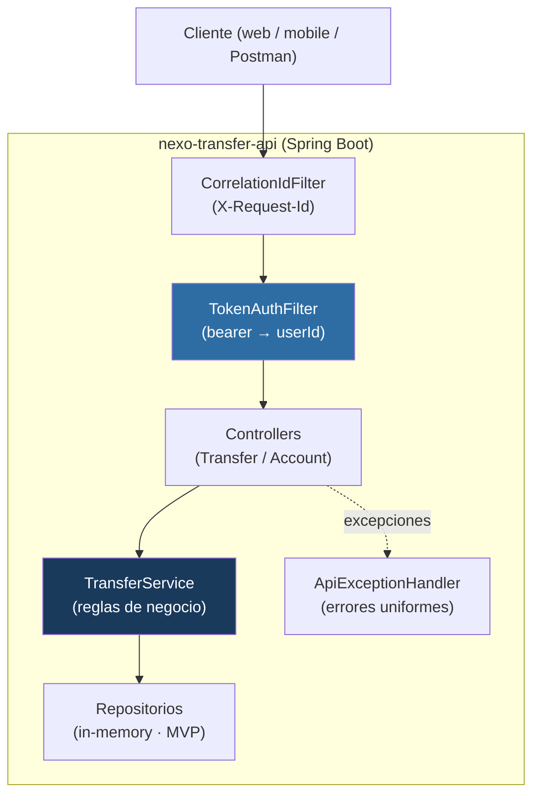

# nexo-transfer-api

API de transferencias ficticias del ecosistema **Nexo Finanzas** — **segura y trazable**. Es el
núcleo del portfolio: define el contrato del que dependen los canales web y mobile.


> ⚠️ **Datos ficticios.** Cuentas, usuarios, saldos y transferencias son de demostración y no
> representan a ninguna entidad, persona ni sistema real.

---

## ⏱️ En 5 minutos

**Qué es.** Un servicio REST que ejecuta transferencias entre cuentas con las garantías que se
esperan en el sector financiero: **validación**, **autorización por titularidad**, **idempotencia**
(un reintento no duplica un movimiento) y **trazabilidad** (cada request tiene un id de correlación).

**Arquitectura, breve.** Una API Spring Boot con el dominio aislado de la web; almacenamiento en
memoria en el MVP (migrable a PostgreSQL sin tocar el dominio). Autenticación por bearer token.

**Prerequisitos.** JDK 21 y Maven (o solo Docker).

**Arrancar y verificar:**

```bash
# Opción A — local
mvn test                                  # 12/12 pruebas (unitarias + BDD)
mvn -DskipTests package
java -jar target/nexo-transfer-api-0.1.0.jar
# Opción B — contenedor
docker compose up --build

# Verificar (en otra terminal)
curl -H "Authorization: Bearer tok-ana-local-dev" \
  http://localhost:8080/api/v1/accounts/acc-ana-001/balance
```

Documentación interactiva (OpenAPI/Swagger): `http://localhost:8080/swagger-ui.html`.

---

## 🧭 Para desarrolladores y QA

### Arquitectura



El corazón es `TransferService`: recibe un comando y **decide** sin depender de HTTP, lo que lo
hace testeable de forma unitaria además de por BDD de punta a punta.

### Endpoints

| Método | Ruta | Descripción | Auth |
|---|---|---|---|
| `POST` | `/api/v1/transfers` | Crea una transferencia (header opcional `Idempotency-Key`) | Bearer |
| `GET` | `/api/v1/transfers/{id}` | Consulta una transferencia (solo si el usuario está involucrado) | Bearer |
| `GET` | `/api/v1/accounts/{id}/balance` | Saldo de una cuenta propia | Bearer |
| `GET` | `/actuator/health` | Health check | Pública |

### Reglas de negocio (resumen)

- El origen debe **existir** y **pertenecer** al usuario autenticado (si no → `403`).
- Origen y destino distintos; monedas coincidentes; monto > 0.
- **Saldo suficiente** (si no → `422 INSUFFICIENT_FUNDS`).
- **Idempotencia:** misma `Idempotency-Key` + mismo cuerpo → devuelve la transferencia original;
  misma key + cuerpo distinto → `409 IDEMPOTENCY_CONFLICT`.

### Pruebas

- **Unitarias** (`TransferServiceTest`): reglas de dominio, rápidas, sin servidor.
- **BDD** (Cucumber en español + REST-assured): escenarios de punta a punta por HTTP real.
- **Postman/Newman**: colección ejecutable (`postman/`), con aserciones, para CI y exploración.

```bash
mvn test                                    # unitarias + BDD
newman run postman/nexo-transfer-api.postman_collection.json   # con la app corriendo
```

### Evidencia

Corridas reales (pruebas, smoke HTTP, Newman y Docker) documentadas en [`evidence/`](evidence/).

---

## 👔 Para líderes de proyecto y reclutadores

- **Qué demuestra:** diseño de una API de dominio financiero con foco en **calidad y testabilidad**
  — separación de capas, reglas de negocio explícitas, idempotencia, autorización, manejo de errores
  uniforme y trazabilidad; validada con pruebas unitarias, BDD y colección Postman.
- **Trazabilidad y aprendizaje:** cada decisión con alternativas está documentada como
  [ADR](docs/adr/); la estrategia de pruebas, la matriz de riesgos y la trazabilidad
  requisito→prueba están en [`docs/quality/`](docs/quality/).
- **Reproducibilidad:** corre igual en local y en contenedor (`docker compose up`); el pipeline de
  CI valida cada cambio.
- **Seguridad:** sin secretos versionados; todo se configura por variables de entorno
  ([`.env.example`](.env.example)).

### Mapa de documentación

| Necesito… | Ir a |
|---|---|
| Entender el problema y las reglas | [`docs/01-problema-y-reglas-de-negocio.md`](docs/01-problema-y-reglas-de-negocio.md) |
| Ver la arquitectura (C4) | [`docs/architecture/`](docs/architecture/) |
| Entender una decisión técnica | [`docs/adr/`](docs/adr/) |
| Estrategia de pruebas / riesgos / trazabilidad | [`docs/quality/`](docs/quality/) |
| Levantar el entorno / resolver problemas | [`docs/runbooks/`](docs/runbooks/) |
| Aprender los conceptos | [`docs/learning/`](docs/learning/) |
| Empezar de cero | [`docs/00-empezar-aqui.md`](docs/00-empezar-aqui.md) |

---

## Ecosistema Nexo Finanzas

Este es el repositorio **1 de 7**. Los canales web (Selenium) y mobile (Appium) consumen este
contrato; la regresión cross-channel (Katalon), la performance (JMeter), la torre de control
(Xray) y la plataforma de entrega (GitLab CI / Jenkins / Docker / K8s) se apoyan en él.

## Licencia

MIT — ver [`LICENSE`](LICENSE). (English version: [`README.en.md`](README.en.md).)
