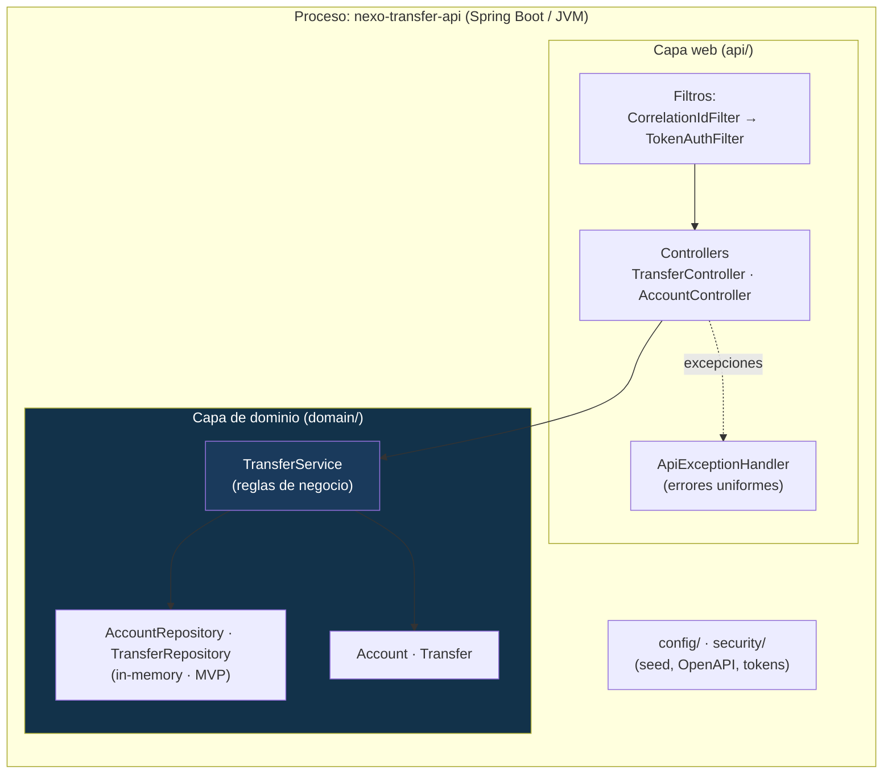

# Arquitectura — Contenedores y capas (C4 nivel 2)

Cómo está organizada la aplicación por dentro.

## Capas

| Capa | Paquete | Responsabilidad |
|---|---|---|
| **Web** | `api/` | Traducir HTTP ↔ dominio: DTOs, validación de entrada, códigos de estado, errores. |
| **Dominio** | `domain/` | Reglas de negocio, entidades y persistencia. **No conoce HTTP.** |
| **Seguridad** | `security/` | Autenticación por token y correlación de requests (trazabilidad). |
| **Config** | `config/` | Datos de arranque (seed) y documentación OpenAPI. |

## Por qué esta separación

- El **dominio aislado de la web** permite probar las reglas de negocio de forma unitaria (rápido,
  sin servidor) y cambiar el transporte o la persistencia sin reescribir la lógica.
- Los **filtros en cadena** (correlación → autenticación) garantizan que toda request tenga id de
  traza y que la autorización se resuelva antes de llegar al controlador.
- El **manejo de errores centralizado** asegura un contrato de error uniforme, clave para
  automatizar pruebas negativas estables.

## Límite actual y evolución

Los repositorios son **en memoria** (MVP). Al estar detrás de una interfaz de repositorio, migrar a
PostgreSQL (ver [ADR-003](../adr/ADR-003-almacenamiento-en-memoria.md)) no toca el dominio ni la web.
