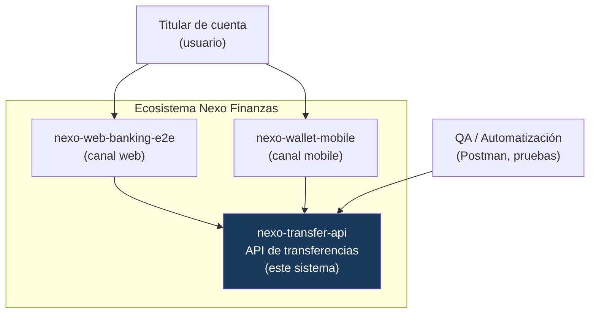

# Arquitectura — Contexto (C4 nivel 1)

Ubica al sistema dentro del ecosistema Nexo Finanzas: quién lo usa y con qué se relaciona.

## Actores y sistemas

| Elemento | Rol |
|---|---|
| **Titular de cuenta** | Persona que inicia transferencias desde un canal (web o mobile). |
| **QA / Automatización** | Ejercita la API directamente (colección Postman, pruebas BDD). |
| **nexo-transfer-api** | Este sistema: ejecuta y valida transferencias. Fuente de la verdad del dominio. |
| **Canal web / mobile** | Consumen el contrato de esta API (o lo imitan explícitamente). |

## Decisiones de contexto

- La API **no tiene UI**: es un servicio de dominio. Los canales aportan la experiencia de usuario.
- La API es la **fuente de la verdad** de las reglas de transferencia; los canales no las reimplementan,
  las consumen. Esto evita divergencias de comportamiento entre web y mobile.
- **Autenticación** por bearer token (un proveedor de identidad real quedaría fuera de este sistema).
