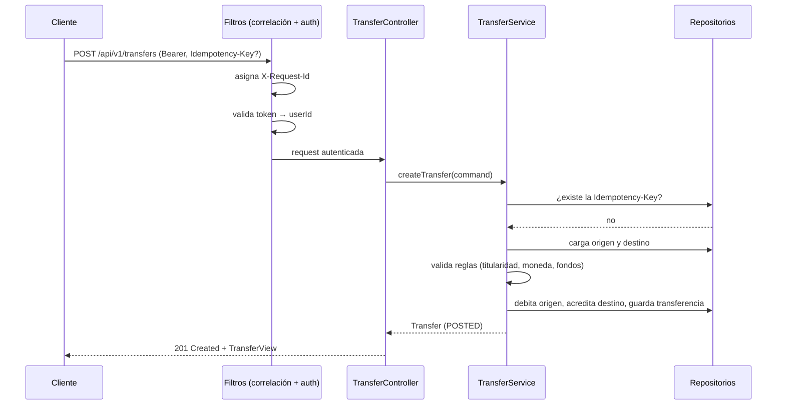
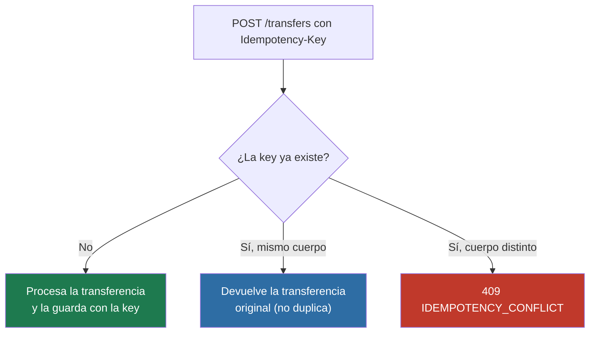

# Arquitectura — Diagramas de flujo

## Secuencia: creación de una transferencia (camino feliz)

## Decisión: idempotencia

## Manejo de errores → códigos HTTP

| Excepción de dominio | HTTP | `code` |
|---|---|---|
| `AccountNotFound` | 404 | `ACCOUNT_NOT_FOUND` |
| `NotFound` (transferencia) | 404 | `NOT_FOUND` |
| `Forbidden` | 403 | `FORBIDDEN` |
| `Invalid` | 400 | `INVALID_REQUEST` |
| validación de entrada | 400 | `VALIDATION_ERROR` |
| `InsufficientFunds` | 422 | `INSUFFICIENT_FUNDS` |
| `IdempotencyConflict` | 409 | `IDEMPOTENCY_CONFLICT` |
| inesperada | 500 | `INTERNAL_ERROR` |
