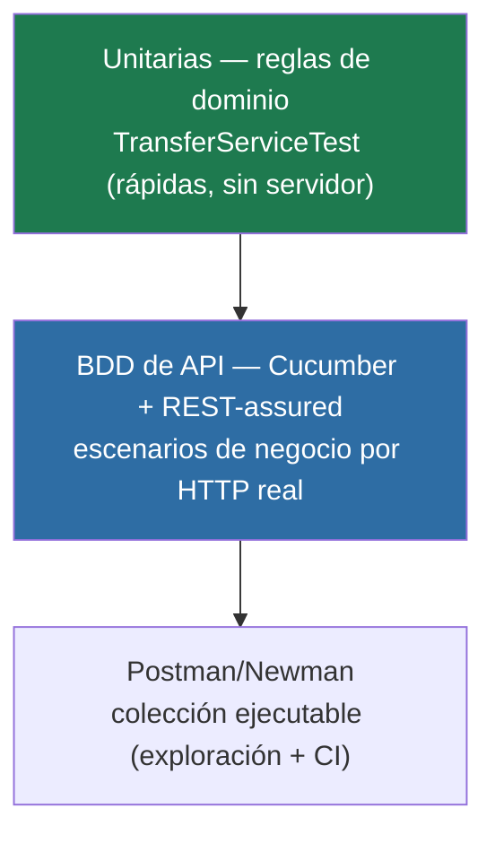

# Estrategia de pruebas

## Objetivo

Verificar que las reglas de negocio se cumplen y que el contrato de la API es estable, con pruebas
**rápidas, deterministas y reproducibles**, ubicadas en el nivel más barato posible (pirámide de
pruebas).

## Niveles



| Nivel | Herramienta | Qué cubre | Por qué acá |
|---|---|---|---|
| **Unitario** | JUnit 5 + AssertJ | Cada regla de negocio de `TransferService` | Rápido, sin levantar el servidor; ideal para la lógica pura. |
| **BDD / API** | Cucumber (español) + REST-assured | Escenarios de negocio de punta a punta por HTTP | Lenguaje de negocio legible; valida el contrato real. |
| **Colección** | Postman + Newman | Los mismos flujos, ejecutables desde CI o a mano | Herramienta pedida por el rol; útil para exploración y demo. |

## Decisiones

- **Cucumber en español**: los escenarios describen negocio, no implementación; los lee cualquiera.
- **REST-assured contra puerto aleatorio real**: se prueba la app entera (filtros, auth, errores),
  no un mock.
- **Aislamiento por escenario**: un hook `@Before` reinicia el estado (ver ADR-003). Sin esto, un
  escenario contaminaría a otro (bug real que encontramos y corregimos; ver `common-mistakes.md`).
- **Datos deterministas**: el seed define un estado inicial conocido → pruebas estables.

## Qué NO se prueba (todavía)

Rendimiento (lo cubre `nexo-performance-lab` con JMeter), seguridad dinámica profunda (DAST), y
persistencia SQL real (llega con PostgreSQL).

## Cómo ejecutar

```bash
mvn test                                                   # unitarias + BDD
newman run postman/nexo-transfer-api.postman_collection.json   # con la app corriendo
```
